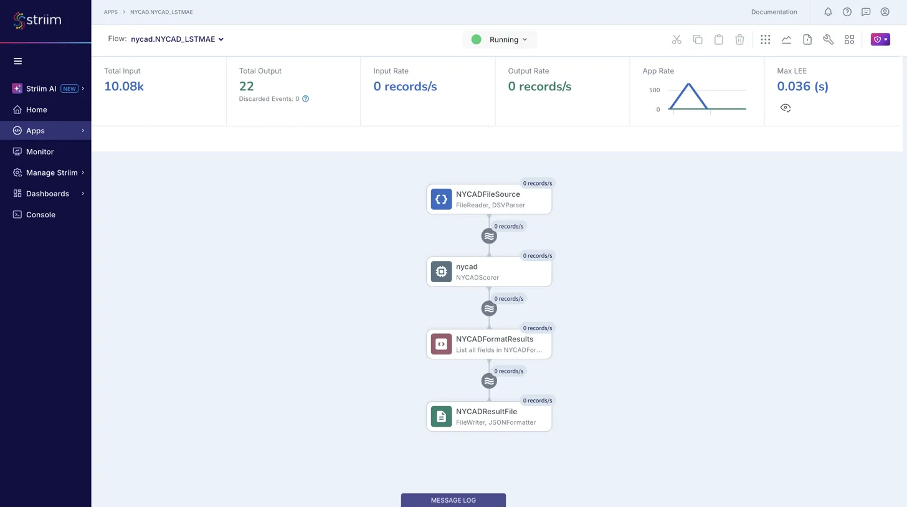

# Striim LSTM-AE Anomaly Detection Pipeline: Setup Guide

**Striim Version:** Platform 5.2.0.4 (OpenJDK 11)
**Pipeline:** FileReader -> Open Processor (buffering + LSTM-AE API scoring) -> Format CQ -> FileWriter (JSON)

This guide walks through setting up the end-to-end Striim LSTM-AE anomaly detection pipeline. The pipeline ingests NYC taxi demand data (30-minute intervals), buffers 336-point weekly windows inside the Open Processor, scores each window against a pre-trained LSTM Encoder-Decoder model via HTTP, and writes anomaly results to JSON.

This uses the **WAEvent pass-through pattern**: no typed streams, no types JAR, no `CREATE TYPE` statements. The OP reads directly from the FileReader's native `Global.WAEvent` output and handles all parsing, windowing, and scoring internally.

The Open Processor is pre-built in this repository. You do not need to compile anything.

---

## Table of Contents

1. [Prerequisites](#1-prerequisites)
2. [Start the Scoring API](#2-start-the-scoring-api)
3. [Deploy to Striim](#3-deploy-to-striim)
4. [Wire the Open Processor in Flow Designer](#4-wire-the-open-processor-in-flow-designer)
5. [Run and Verify](#5-run-and-verify)
6. [Results](#6-results)
7. [Teardown and Re-runs](#7-teardown-and-re-runs)

---

## 1. Prerequisites

| Requirement | Detail |
|---|---|
| Striim Platform | 5.2.0.4, installed at `$STRIIM_HOME` (e.g. `/opt/Striim`) |
| Java | OpenJDK 11 |
| Python | 3.11+ with `fastapi`, `uvicorn`, `torch`, `numpy`, `scikit-learn`, `pandas` |

Set `STRIIM_HOME`:

```bash
export STRIIM_HOME="/opt/Striim"
```

Pre-built artifacts in this repo:

| Artifact | Path | Purpose |
|---|---|---|
| OP module (.scm) | `striim/nycad-scorer/target/NYCADScorer.scm` | Striim Open Processor (fat JAR, WAEvent pass-through) |
| TQL | `striim/NYCAD.tql` | Striim application definition (~70 lines) |
| Data | `data/nyc_taxi_sunday_aligned.csv` | NYC taxi demand data, pre-trimmed to Sunday start |
| Scoring API | `striim/api/main.py` | FastAPI service wrapping the LSTM-AE model |

---

## 2. Start the Scoring API

The scoring API must be running before the Striim application starts. It loads the pre-trained LSTM Encoder-Decoder model and exposes a `/v1/score` endpoint.

```bash
cd <repo>
uv pip install fastapi uvicorn
python -m uvicorn striim.api.main:app --port 8000
```

Verify:

```bash
curl -s http://localhost:8000/health | python -m json.tool
```

Expected:
```json
{
    "status": "healthy",
    "model": "lstm-ae",
    "window_size": 336,
    "threshold": 5097650.624144599
}
```

Leave this running in a separate terminal.

---

## 3. Deploy to Striim

### 3.1 Copy the .scm module

```bash
cp <repo>/striim/nycad-scorer/target/NYCADScorer.scm $STRIIM_HOME/modules/NYCADScorer.scm
```

### 3.2 Start Striim (if not already running)

```bash
export JAVA_HOME=/opt/homebrew/opt/openjdk@11
cd $STRIIM_HOME && bin/server.sh
```

### 3.3 Load the Open Processor

In the Striim console:

```sql
LOAD OPEN PROCESSOR "/opt/Striim/modules/NYCADScorer.scm";
```

Verify:

```sql
LIST OPENPROCESSORS;
```

`NYCADScorer` should appear in the list.

### 3.4 Import the TQL application

Paste the contents of `striim/NYCAD.tql` into the Striim console. The full TQL is:

```sql
CREATE NAMESPACE nycad;
USE nycad;

CREATE APPLICATION NYCAD_LSTMAE;

CREATE SOURCE NYCADFileSource USING FileReader (
  directory: '/tmp/nycad_test',
  wildcard: 'nyc_taxi*.csv',
  positionByEOF: false
)
PARSE USING DSVParser (
  columndelimiter: ',',
  header: true
)
OUTPUT TO NYCADRawStream;

CREATE STREAM NYCADResultStream OF Global.WAEvent;

CREATE CQ NYCADFormatResults
INSERT INTO NYCADFormattedStream
SELECT
  TO_STRING(data[0]) AS is_anomaly,
  TO_STRING(data[1]) AS anomaly_score,
  TO_STRING(data[2]) AS threshold,
  TO_STRING(data[3]) AS window_start,
  TO_STRING(data[4]) AS window_end
FROM NYCADResultStream;

CREATE TARGET NYCADResultFile USING FileWriter (
  directory: '/tmp/nycad_test',
  filename: 'scored_output'
)
FORMAT USING JSONFormatter ()
INPUT FROM NYCADFormattedStream;

END APPLICATION NYCAD_LSTMAE;
```

All statements should return `SUCCESS`.

---

## 4. Wire the Open Processor in Flow Designer

This is the only step that cannot be done in TQL. The OP's input stream (`NYCADRawStream`) is a native `Global.WAEvent` from the FileReader, and the annotation uses `com.webaction.proc.events.WAEvent.class`. Flow Designer handles the type bridging between the auto-created stream and the WAEvent annotation.

1. In the Striim web UI, navigate to **Apps** and open `nycad.NYCAD_LSTMAE`
2. Click to enter **Flow Designer**
3. Drag **Striim Open Processor** from the Base Components palette into the workspace
4. Configure:
   - **Name:** `nycad` (or any name)
   - **Module:** Select `NYCADScorer` from the dropdown
   - **Input Stream:** `NYCADRawStream`
   - **Output Stream:** `NYCADResultStream`
5. Click **Save**

---

## 5. Run and Verify

### 5.1 Deploy and start

```sql
USE nycad;
DEPLOY APPLICATION nycad.NYCAD_LSTMAE;
START APPLICATION nycad.NYCAD_LSTMAE;
```

### 5.2 Copy data file (after app is running)

**Important:** Copy the file AFTER the app starts. FileReader ignores files that already exist when the application launches.

```bash
mkdir -p /tmp/nycad_test
cp <repo>/data/nyc_taxi_sunday_aligned.csv /tmp/nycad_test/
```

### 5.3 Monitor

**API terminal** -- scoring requests appear in real time:

```
score_request score=10110522.2674 is_anomaly=True window=[2015/01/25 00:00:00.000, 2015/01/31 23:30:00.000]
  Localized to 6h: 2015-01-26 16:30:00 - 2015-01-26 22:00:00 (contrast=2.29)
  latency=8.7ms
```

**Striim server log:**

```bash
grep "NYCADScorer" $STRIIM_HOME/logs/striim.server.log | grep "Scored" | tail -10
```

**Flow Designer** -- open the app in the web UI to see record counts on each node.

During ingestion, the pipeline processes at ~400-700 records/s:


After ingestion completes, Total Output should show **22**:



**Output files:**

```bash
ls -la /tmp/nycad_test/scored_output*
cat /tmp/nycad_test/scored_output.00
```

---

## 6. Results

With the `nyc_taxi_sunday_aligned.csv` dataset (10,080 rows, July 6 2014 through January 31 2015):

| Metric | Value |
|---|---|
| Input records | 10,080 |
| Windows assembled by OP | ~9,744 (sliding window emits on each new row) |
| Windows actually scored | 22 (API filters to Sunday-aligned, post-training only) |
| Windows skipped (204) | ~9,722 |
| API latency | ~10ms per scored window |
| Threshold | 5,097,651 (Mahalanobis distance, 99.99th percentile) |

### How the filtering works

The OP internally buffers 336 consecutive values (one week of 30-minute data). After the initial fill, every new row triggers a new overlapping window. The OP calls the scoring API for each window. The API filters these down:

1. **Sunday alignment** -- only scores windows whose `window_start` falls on a Sunday at midnight (returns 204 for all others)
2. **Training cutoff** -- only scores windows starting on or after Aug 31, 2014 (returns 204 for training-era data)
3. The OP receives the 204 (empty response body) and silently skips `send()`, so no result is written downstream

This produces exactly one score per non-overlapping week in the test period.

### Detected anomalies

The model achieves 5/5 detection on known NYC events.

| Week | Score | Threshold | Result | Event |
|---|---|---|---|---|
| 2014-11-02 | 11,749,746 | 5,097,651 | **ANOMALY** | NYC Marathon |
| 2014-11-23 | 8,480,764 | 5,097,651 | **ANOMALY** | Thanksgiving |
| 2014-12-21 | 10,472,830 | 5,097,651 | **ANOMALY** | Christmas |
| 2014-12-28 | 13,543,827 | 5,097,651 | **ANOMALY** | New Year's |
| 2015-01-18 | 5,643,154 | 5,097,651 | **ANOMALY** | January Blizzard (early) |
| 2015-01-25 | 10,110,522 | 5,097,651 | **ANOMALY** | January Blizzard (peak) |

All 16 normal weeks scored below threshold with zero false positives.

### Example JSON output

Normal window:
```json
{
  "is_anomaly": "false",
  "anomaly_score": "2472926.2783990074",
  "threshold": "5097650.624144599",
  "window_start": "2014-10-12 00:00:00",
  "window_end": "2014-10-18 23:30:00"
}
```

Anomaly window (NYC Marathon):
```json
{
  "is_anomaly": "true",
  "anomaly_score": "1.174974631523868E7",
  "threshold": "5097650.624144599",
  "window_start": "2014-11-02 00:00:00",
  "window_end": "2014-11-08 23:30:00"
}
```

Anomaly window (January Blizzard):
```json
{
  "is_anomaly": "true",
  "anomaly_score": "1.0110522267350838E7",
  "threshold": "5097650.624144599",
  "window_start": "2015-01-25 00:00:00",
  "window_end": "2015-01-31 23:30:00"
}
```

---

## 7. Teardown and Re-runs

### Stop the application

```sql
USE nycad;
STOP APPLICATION nycad.NYCAD_LSTMAE;
UNDEPLOY APPLICATION nycad.NYCAD_LSTMAE;
```

### Re-run with same data

FileReader tracks files by name. Use a unique filename for each run:

```bash
rm -f /tmp/nycad_test/scored_output*
rm -f /tmp/nycad_test/nyc_taxi*.csv
cp <repo>/data/nyc_taxi_sunday_aligned.csv /tmp/nycad_test/nyc_taxi.csv
```

Then redeploy and start:

```sql
DEPLOY APPLICATION nycad.NYCAD_LSTMAE;
START APPLICATION nycad.NYCAD_LSTMAE;
```

### Full reset

```sql
USE nycad;
STOP APPLICATION nycad.NYCAD_LSTMAE;
UNDEPLOY APPLICATION nycad.NYCAD_LSTMAE;
DROP APPLICATION nycad.NYCAD_LSTMAE CASCADE;
USE admin;
UNLOAD OPEN PROCESSOR "/opt/Striim/modules/NYCADScorer.scm";
DROP NAMESPACE nycad;
```

Stop Striim with Ctrl+C, then:

```bash
rm -f $STRIIM_HOME/.striim/OpenProcessor/NYCADScorer.scm
rm -f $STRIIM_HOME/modules/NYCADScorer.scm
rm -f /tmp/nycad_test/scored_output*
rm -f /tmp/nycad_test/nyc_taxi*.csv
$STRIIM_HOME/bin/server.sh
```

Then start from [Step 3](#3-deploy-to-striim).

---

## Deployment Order (Quick Reference)

```
1. Start scoring API         python -m uvicorn striim.api.main:app --port 8000
2. Copy .scm                 cp target/NYCADScorer.scm $STRIIM_HOME/modules/
3. Start Striim              $STRIIM_HOME/bin/server.sh
4. LOAD OP                   LOAD OPEN PROCESSOR "/opt/Striim/modules/NYCADScorer.scm";
5. Paste TQL                 CREATE NAMESPACE nycad; USE nycad; ... END APPLICATION;
6. Wire OP in Flow Designer  NYCADRawStream -> NYCADScorer -> NYCADResultStream
7. Deploy + Start + Data     DEPLOY; START; cp data to /tmp/nycad_test/
```

---

## Data Flow

```
NYCADFileSource (FileReader + DSVParser, watches /tmp/nycad_test/)
    |
    v
NYCADRawStream (native Global.WAEvent: data[0]=timestamp, data[1]=value)
    |
    v
NYCADScorer OP (internal 336-row sliding buffer, HTTP POST to localhost:8000/v1/score)
    |  - Buffers raw CSV rows, assembles weekly windows internally
    |  - API returns 204 for non-Sunday / training-era windows (OP skips send())
    |  - API returns 200 with score for Sunday-aligned test windows (~10ms)
    |  - Emits results via in-place WAEvent data[] modification
    v
NYCADResultStream (Global.WAEvent: data[0..4] = result fields)
    |
    v
NYCADFormatResults CQ (extracts data[0..4] into named fields)
    |
    v
NYCADFormattedStream (is_anomaly, anomaly_score, threshold, window_start, window_end)
    |
    v
NYCADResultFile (FileWriter + JSONFormatter -> /tmp/nycad_test/scored_output)
```

---

### Repo Structure

```
striim/
├── NYCAD.tql                         # Application TQL
└── nycad-scorer/
    ├── build.sh                      # One-command build + install script
    ├── pom.xml                       # Maven config (shade plugin, no types dependency)
    ├── target/
    │   └── NYCADScorer.scm           # Pre-built module (committed to repo)
    └── src/
        └── main/java/com/striim/nycad/
            └── NYCADScorer.java
```

### Prerequisites for Building

**Java:** OpenJDK 11. On macOS with Homebrew: `/opt/homebrew/opt/openjdk@11`.

**Maven** 3.9+ for compiling the Open Processor Java module.

**Striim runtime JAR:** The OP annotation uses `com.webaction.proc.events.WAEvent.class`, which is not in the SDK. `build.sh` installs the Striim server JAR containing this class (`Common-5.2.0.4.jar`) as a provided Maven dependency.


## Environment Reference

| Component | Detail |
|---|---|
| Striim Platform | 5.2.0.4 at `$STRIIM_HOME` |
| Scoring API | `http://localhost:8000` |
| Namespace | `nycad` |
| Application | `nycad.NYCAD_LSTMAE` |
| OP module | `NYCADScorer` (loaded from `$STRIIM_HOME/modules/`) |
| Data file | `data/nyc_taxi_sunday_aligned.csv` (copy to `/tmp/nycad_test/` after app starts) |
| Output | `/tmp/nycad_test/scored_output.00`, `.01`, etc. |
| Striim logs | `$STRIIM_HOME/logs/striim.server.log` |
| API logs | Terminal where uvicorn is running |
| Model artifacts | `models/lstm_model.pt`, `scaler.pkl`, `scorer.pkl` |
| Window size | 336 rows (7 days x 48 half-hour intervals) |
| Buffering | Internal to the OP (ArrayList-based sliding window) |
| Scoring | Window-level Mahalanobis distance on reconstruction error |
| Threshold | 5,097,651 (calibrated on training data at 99.99th percentile) |
| Annotation type | `com.webaction.proc.events.WAEvent` (runtime class from `Common-5.2.0.4.jar`) |