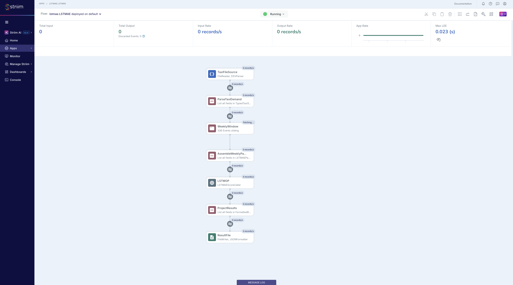
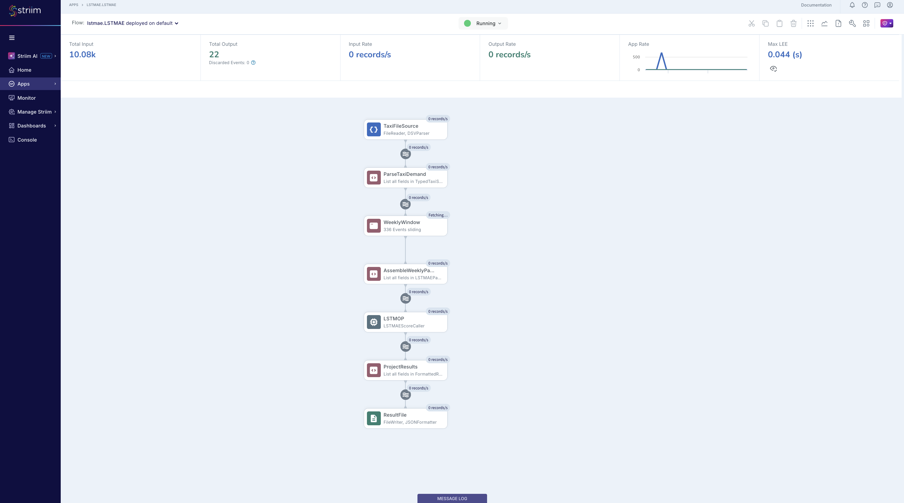

# Striim LSTM-AE Anomaly Detection Pipeline: Setup Guide

**Striim Version:** Platform 5.2.0.4 (OpenJDK 11)
**Pipeline:** FileReader -> Parse CQ -> 336-Row Sliding Window -> Assembly CQ -> Open Processor (LSTM-AE API) -> ProjectResults CQ -> FileWriter (JSON)

This guide walks through setting up the end-to-end Striim LSTM-AE anomaly detection pipeline. The pipeline ingests NYC taxi demand data (30-minute intervals), assembles weekly windows of 336 data points, scores each window against a pre-trained LSTM Encoder-Decoder model via HTTP, and writes anomaly results to JSON.

The Open Processor and type JARs are pre-built in this repository. You do not need to compile anything.

---

## Table of Contents

1. [Prerequisites](#1-prerequisites)
2. [Start the Scoring API](#2-start-the-scoring-api)
3. [Deploy to Striim](#3-deploy-to-striim)
4. [Wire the Open Processor in Flow Designer](#4-wire-the-open-processor-in-flow-designer)
5. [Run and Verify](#5-run-and-verify)
6. [Results](#6-results)
7. [Teardown and Re-runs](#7-teardown-and-re-runs)

---

## 1. Prerequisites

| Requirement | Detail |
|---|---|
| Striim Platform | 5.2.0.4, installed at `$STRIIM_HOME` (e.g. `/opt/Striim`) |
| Java | OpenJDK 11 |
| Python | 3.11+ with `fastapi`, `uvicorn`, `torch`, `numpy`, `scikit-learn`, `pandas` |

Set `STRIIM_HOME`:

```bash
export STRIIM_HOME="/opt/Striim"
```

Pre-built artifacts in this repo:

| Artifact | Path | Purpose |
|---|---|---|
| OP module (.scm) | `striim/lstm-ae-score-caller/target/LSTMAEScoreCaller.scm` | Striim Open Processor (fat JAR, types excluded) |
| Types JAR | `striim/lstm-ae-score-caller/target/lstmae_types.jar` | Hand-built `_1_0` type classes for `$STRIIM_HOME/lib/` |
| TQL | `striim/LSTMAE.tql` | Striim application definition |
| Data | `data/nyc_taxi_sunday_aligned.csv` | NYC taxi demand data, pre-trimmed to Sunday start |
| Scoring API | `striim/api/main.py` | FastAPI service wrapping the LSTM-AE model |

If the pre-built `.scm` or types JAR are missing, build them with:

```bash
cd striim/lstm-ae-score-caller && chmod +x build.sh && ./build.sh
```

---

## 2. Start the Scoring API

The scoring API must be running before the Striim application starts. It loads the pre-trained LSTM Encoder-Decoder model and exposes a `/v1/score` endpoint.

```bash
cd <repo>
uv pip install fastapi uvicorn
python -m uvicorn striim.api.main:app --port 8000
```

Verify:

```bash
curl -s http://localhost:8000/health | python -m json.tool
```

Expected:
```json
{
    "status": "healthy",
    "model": "lstm-ae",
    "window_size": 336,
    "threshold": 5097650.624144599
}
```

Leave this running in a separate terminal.

---

## 3. Deploy to Striim

This is a multi-step process because Striim has two separate type systems (registry and classpath) that must both contain the types, but they conflict during creation.

### 3.1 Install the types JAR and stop Striim

```bash
cp <repo>/striim/lstm-ae-score-caller/target/lstmae_types.jar $STRIIM_HOME/lib/lstmae_types.jar
```

If Striim is running, stop it with Ctrl+C in the Striim terminal.

### 3.2 JAR Removal Trick: create types without classpath conflict

The types JAR must be absent from `lib/` when creating types (to avoid "class already exists" errors), then restored before running the OP.

```bash
# Move types JAR out temporarily
mv $STRIIM_HOME/lib/lstmae_types.jar /tmp/lstmae_types.jar

# Start Striim without types on classpath
$STRIIM_HOME/bin/server.sh   # start
```

### 3.3 Create namespace, types, and import TQL

In the Striim console:

```sql
CREATE NAMESPACE lstmae;
USE lstmae;

CREATE TYPE LSTMAEPayload (
  values_list  String,
  window_start java.lang.String,
  window_end   java.lang.String
);

CREATE TYPE LSTMAEResult (
  is_anomaly    String,
  anomaly_score String,
  threshold     String,
  window_start  String,
  window_end    String
);
```

All statements should return `SUCCESS`. Then import the TQL by pasting the contents of `striim/LSTMAE.tql` into the console (everything from `CREATE APPLICATION LSTMAE` through `END APPLICATION LSTMAE`).

### 3.4 Restore types JAR and restart Striim

Stop Striim with Ctrl+C, then:

```bash
mv /tmp/lstmae_types.jar $STRIIM_HOME/lib/lstmae_types.jar
$STRIIM_HOME/bin/server.sh   # start
```

### 3.5 Copy .scm and load the Open Processor

```bash
cp <repo>/striim/lstm-ae-score-caller/target/LSTMAEScoreCaller.scm $STRIIM_HOME/modules/LSTMAEScoreCaller.scm
```

In the Striim console:

```sql
USE lstmae;
LOAD OPEN PROCESSOR "/opt/Striim/modules/LSTMAEScoreCaller.scm";
```

Verify:

```sql
LIST OPENPROCESSORS;
```

`LSTMAEScoreCaller` should appear in the list.

---

## 4. Wire the Open Processor in Flow Designer

1. In the Striim web UI, navigate to **Apps** and open `lstmae.LSTMAE`
2. Click to enter **Flow Designer**
3. Drag **Open Processor** from the component palette into the workspace
4. Configure:
   - **Module:** `LSTMAEScoreCaller`
   - **Input Stream:** `LSTMAEPayloadStream`
   - **Output Stream:** `LSTMAEResultStream`
5. Set properties (these have fallback defaults in the Java code, but set them anyway):
   - `apiEndpoint`: `http://localhost:8000/v1/score`
   - `timeoutMs`: `5000`
   - `maxRetries`: `3`
6. Click **Save**

---

## 5. Run and Verify

### 5.1 Deploy and start

```sql
USE lstmae;
DEPLOY APPLICATION lstmae.LSTMAE;
START APPLICATION lstmae.LSTMAE;
```

The pipeline should appear in Flow Designer with the status "Running":



### 5.2 Copy data file (after app is running)

**Important:** Copy the file AFTER the app starts. FileReader ignores files that already exist when the application launches.

```bash
mkdir -p /tmp/lstmae_test
cp <repo>/data/nyc_taxi_sunday_aligned.csv /tmp/lstmae_test/
```

### 5.3 Monitor

**API terminal** -- scoring requests appear in real time:

```
score_request score=10110522.2674 is_anomaly=True window=[2015/01/25 00:00:00.000, 2015/01/31 23:30:00.000]
  Localized to 6h: 2015-01-26 16:30:00 - 2015-01-26 22:00:00 (contrast=2.29)
  latency=8.7ms
```

**Striim server log:**

```bash
grep -i "LSTMAEScoreCaller" $STRIIM_HOME/logs/striim.server.log | tail -10
```

**Flow Designer** -- open the app in the web UI to see record counts on each node. After ingestion completes:



**Output files:**

```bash
ls -la /tmp/lstmae_test/scored_output*
cat /tmp/lstmae_test/scored_output.00
```

---

## 6. Results

With the `nyc_taxi_sunday_aligned.csv` dataset (10,080 rows, July 6 2014 through January 31 2015):

| Metric | Value |
|---|---|
| Input records | 10,080 |
| Windows sent to API | ~9,744 (sliding window emits on each new row) |
| Windows actually scored | 22 (API filters to Sunday-aligned, post-training only) |
| Windows skipped (204) | ~9,722 |
| API latency | ~10ms per scored window |
| Threshold | 5,097,651 (Mahalanobis distance, 99.99th percentile) |

### How the filtering works

The sliding window (`KEEP 336 ROWS`) emits a new window on every incoming row after the first 336 accumulate. This produces ~9,744 overlapping windows. The scoring API filters these down:

1. **Sunday alignment** -- only scores windows whose `window_start` is Sunday at midnight (returns 204 for all others)
2. **Training cutoff** -- only scores windows starting on or after Aug 31, 2014 (returns 204 for training-era data)
3. The OP receives the 204 and silently skips `send()`, so no result is written downstream

This produces exactly one score per non-overlapping week in the test period.

### Detected anomalies

The model achieves 5/5 detection on known NYC events.

| Week | Score | Threshold | Result | Event |
|---|---|---|---|---|
| 2014-11-02 | 11,749,746 | 5,097,651 | **ANOMALY** | NYC Marathon |
| 2014-11-23 | 8,480,764 | 5,097,651 | **ANOMALY** | Thanksgiving |
| 2014-12-21 | 10,472,830 | 5,097,651 | **ANOMALY** | Christmas |
| 2014-12-28 | 13,543,827 | 5,097,651 | **ANOMALY** | New Year's |
| 2015-01-25 | 10,110,522 | 5,097,651 | **ANOMALY** | January Blizzard |

All 16 normal weeks scored below threshold with zero false positives.

### Example JSON output

Normal window:
```json
{
  "is_anomaly": "false",
  "anomaly_score": "2472926.2783990074",
  "threshold": "5097650.624144599",
  "window_start": "2014/10/12 00:00:00.000",
  "window_end": "2014/10/18 23:30:00.000"
}
```

Anomaly window (NYC Marathon):
```json
{
  "is_anomaly": "true",
  "anomaly_score": "1.174974631523868E7",
  "threshold": "5097650.624144599",
  "window_start": "2014/11/02 00:00:00.000",
  "window_end": "2014/11/08 23:30:00.000"
}
```

Anomaly window (January Blizzard):
```json
{
  "is_anomaly": "true",
  "anomaly_score": "1.0110522267350838E7",
  "threshold": "5097650.624144599",
  "window_start": "2015/01/25 00:00:00.000",
  "window_end": "2015/01/31 23:30:00.000"
}
```

---

## 7. Teardown and Re-runs

### Stop the application

```sql
USE lstmae;
STOP APPLICATION lstmae.LSTMAE;
UNDEPLOY APPLICATION lstmae.LSTMAE;
```

### Re-run with same data

FileReader tracks files by name. Use a unique filename for each run:

```bash
rm -f /tmp/lstmae_test/scored_output*
rm -f /tmp/lstmae_test/nyc_taxi*.csv
cp <repo>/data/nyc_taxi_sunday_aligned.csv /tmp/lstmae_test/nyc_taxi.csv
```

Then redeploy and start:

```sql
DEPLOY APPLICATION lstmae.LSTMAE;
START APPLICATION lstmae.LSTMAE;
```

### Full reset

```sql
USE lstmae;
STOP APPLICATION lstmae.LSTMAE;
UNDEPLOY APPLICATION lstmae.LSTMAE;
DROP APPLICATION lstmae.LSTMAE CASCADE;
DROP TYPE lstmae.LSTMAEResult;
DROP TYPE lstmae.LSTMAEPayload;
USE admin;
UNLOAD OPEN PROCESSOR "/opt/Striim/modules/LSTMAEScoreCaller.scm";
DROP NAMESPACE lstmae;
```

Stop Striim with Ctrl+C, then:

```bash
rm -f $STRIIM_HOME/.striim/OpenProcessor/LSTMAEScoreCaller.scm
rm -f $STRIIM_HOME/modules/LSTMAEScoreCaller.scm
rm -f $STRIIM_HOME/lib/lstmae_types.jar
rm -f /tmp/lstmae_test/scored_output*
rm -f /tmp/lstmae_test/nyc_taxi*.csv
$STRIIM_HOME/bin/server.sh   # start
```

Then start from [Step 3](#3-deploy-to-striim).

---

## Deployment Order (Quick Reference)

```
 1. Start scoring API        python -m uvicorn striim.api.main:app --port 8000
 2. Install types JAR        cp target/lstmae_types.jar $STRIIM_HOME/lib/
 3. Stop Striim              Ctrl+C in Striim terminal
 4. Remove types JAR         mv $STRIIM_HOME/lib/lstmae_types.jar /tmp/
 5. Start Striim             $STRIIM_HOME/bin/server.sh
 6. CREATE NAMESPACE         CREATE NAMESPACE lstmae;
 7. CREATE TYPEs             CREATE TYPE LSTMAEPayload (...); CREATE TYPE LSTMAEResult (...);
 8. Paste TQL                CREATE APPLICATION LSTMAE; ... END APPLICATION LSTMAE;
 9. Stop Striim              Ctrl+C in Striim terminal
10. Restore types JAR        mv /tmp/lstmae_types.jar $STRIIM_HOME/lib/
11. Start Striim             $STRIIM_HOME/bin/server.sh
12. Copy .scm                cp target/LSTMAEScoreCaller.scm $STRIIM_HOME/modules/
13. LOAD OP                  LOAD OPEN PROCESSOR "/opt/Striim/modules/LSTMAEScoreCaller.scm";
14. Wire OP                  Flow Designer: LSTMAEPayloadStream -> OP -> LSTMAEResultStream
15. Deploy + Start           DEPLOY APPLICATION lstmae.LSTMAE; START APPLICATION lstmae.LSTMAE;
16. Copy data file           cp data/nyc_taxi_sunday_aligned.csv /tmp/lstmae_test/
```

---

## Data Flow

```
TaxiFileSource (FileReader + DSVParser, watches /tmp/lstmae_test/)
    |
    v
RawTaxiStream (WAEvent: data[0]=timestamp, data[1]=value)
    |
    v
ParseTaxiDemand CQ (series_key='nyc_taxi', TO_DATEF for ts, TO_INT for demand_value)
    |
    v
TypedTaxiStream (series_key, ts, demand_value)
    |
    v
WeeklyWindow (KEEP 336 ROWS, PARTITION BY series_key)
    |
    v
AssembleWeeklyPayload CQ (LIST() of 336 values, GROUP BY series_key, HAVING COUNT >= 336)
    |
    v
LSTMAEPayloadStream (values_list, window_start, window_end)
    |
    v
LSTMAEScoreCaller OP (HTTP POST to localhost:8000/v1/score)
    |  - API returns 204 for non-Sunday / training-era windows (OP skips send())
    |  - API returns 200 with score for Sunday-aligned test windows (~10ms)
    v
LSTMAEResultStream (is_anomaly, anomaly_score, threshold, window_start, window_end)
    |
    v
ProjectResults CQ (re-projects fields for JSONFormatter compatibility)
    |
    v
FormattedResultStream (Striim-generated type)
    |
    v
ResultFile (FileWriter + JSONFormatter -> /tmp/lstmae_test/scored_output)
```

---

## Environment Reference

| Component | Detail |
|---|---|
| Striim Platform | 5.2.0.4 at `$STRIIM_HOME` |
| Scoring API | `http://localhost:8000` |
| Namespace | `lstmae` |
| OP module | `LSTMAEScoreCaller` (loaded from `$STRIIM_HOME/modules/`) |
| Types JAR | `$STRIIM_HOME/lib/lstmae_types.jar` (must be present at boot for runtime) |
| Data file | `data/nyc_taxi_sunday_aligned.csv` (copy to `/tmp/lstmae_test/` after app starts) |
| Output | `/tmp/lstmae_test/scored_output.00`, `.01`, etc. |
| Striim logs | `$STRIIM_HOME/logs/striim.server.log` |
| API logs | Terminal where uvicorn is running |
| Model artifacts | `models/lstm_model.pt`, `scaler.pkl`, `scorer.pkl` |
| Window size | 336 rows (7 days x 48 half-hour intervals) |
| Window type | Count-based sliding (`KEEP 336 ROWS PARTITION BY series_key`) |
| Scoring | Window-level Mahalanobis distance on reconstruction error |
| Threshold | 5,097,651 (calibrated on training data at 99.99th percentile) |

